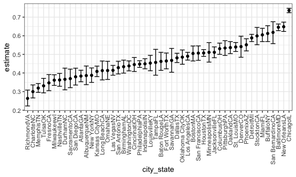
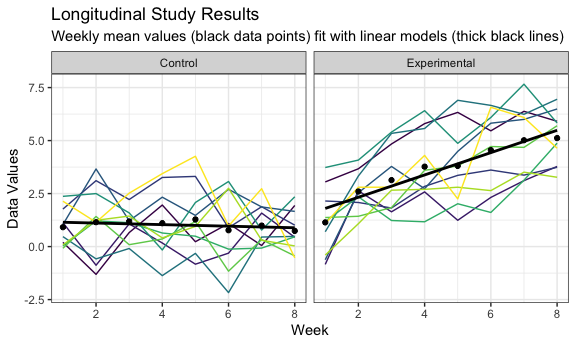

p8105\_hw5\_jae2186
================
UNI: jae2186 (Jennifer Estrada)
11/20/2021

# Problem 1

<i>(Solved via method discussed in P8105 office hours on
11/15/2021.)</i>

After collecting data on homicides throughout cities in the United
States, the <i>Washington Post</i> made the data readily available. The
data are uploaded and modified below with an overall discussion of the
data and a deeper dive into the data for the city of Balitmore in
Maryland.

``` r
homicide_df <-
  read_csv("./homicide-data.csv", na = c("", "Unknown")) %>% 
  mutate(city_state = str_c(city, state),
         resolution = case_when(disposition == "Closed without arrest" ~ "unsolved",
                                disposition == "Open/No arrest"        ~ "unsolved",
                                disposition == "Closed by arrest"      ~ "solved" )
         ) %>% 
  relocate(city_state) %>% 
  filter(city_state != "TulsaAL")
```

    ## Rows: 52179 Columns: 12

    ## ── Column specification ────────────────────────────────────────────────────────
    ## Delimiter: ","
    ## chr (8): uid, victim_last, victim_first, victim_race, victim_sex, city, stat...
    ## dbl (4): reported_date, victim_age, lat, lon

    ## 
    ## ℹ Use `spec()` to retrieve the full column specification for this data.
    ## ℹ Specify the column types or set `show_col_types = FALSE` to quiet this message.

The raw data is substantial as it consists of 52178 entries across 50
unique cities (with the exception of an entry with an erroneous city and
state combination). The data include variables to describe the homocide
cases like the reported date of the homicide, first and last names of
the victims as well as some demogrphic information on the victim, and
whether or not the case was closed or is left open.

The following code focuses on data from a single city: Baltimore, MD.

``` r
baltimore_df <-
  homicide_df %>% 
  filter(city_state == "BaltimoreMD")

baltimore_summary <-
  baltimore_df %>% 
  summarize(unsolved = sum(resolution == "unsolved"),
            n = n()
            )

baltimore_test <-
  prop.test(
    x = baltimore_summary %>%  pull(unsolved),
    n = baltimore_summary %>%  pull(n))

b_estimate <- 
  baltimore_test %>% 
  broom::tidy() %>% 
  pull(estimate)
```

As derived above from the code above, during the timeframe of this
investigation Baltimore had an unsolved homicide rate of 64.6%.

The following codes then extends this kind of analysis across all of the
cities available in the dataset and provides a plot with the data
including error bars from the upper and lower confidence interval limits
and in order of increasing proportion of unsolved homicide cases.

``` r
prop_test_function = function(city_df) {
  
  city_summary <-
    city_df %>% 
    summarize(unsolved = sum(resolution == "unsolved"),
              n = n()
              )
  
  city_test <-
    prop.test(
      x = city_summary %>%  pull(unsolved),
      n = city_summary %>%  pull(n))
  
  return(city_test)

}


results_df <- 
  homicide_df %>% 
  nest(data = uid:resolution) %>% 
  mutate(
    test_results = map(data, prop_test_function),
    tidy_results = map(test_results, broom::tidy)
  ) %>% 
  select(city_state, tidy_results) %>% 
  unnest(tidy_results) %>% 
  select(city_state, estimate, starts_with("conf"))
```

``` r
results_df %>% 
  mutate(city_state = fct_reorder(city_state, estimate)) %>% 
  ggplot(aes(x = city_state, y = estimate)) +
  geom_point() + 
  geom_errorbar(aes(ymin = conf.low, ymax = conf.high)) +
  theme(axis.text.x = element_text(angle = 90, vjust = 0.5, hjust = 1))
```



As shown in the plot, Chicago, IL has the most cases of unsolved
homicide cases with Baltimore closer to this higher and the third most
homicide cases while Richmond, VA has the fewest cases.

# Problem 2

For this problem we have been provided with a zip file containing
several data files for participants in a longitudinal study in which
weekly data was collected from subjects in both control and experimental
study arms. The following code chunk extracts the data from each file
and tidies it appropriately for subsequent plotting.

``` r
long_study <-
  tibble(files = list.files("./data")) %>% 
  mutate(files = str_c("./data/", files),
         data = map(files, read_csv),
         files = list.files("./data"),
         files = str_remove(files, ".csv")) %>% 
  unnest(data) %>% 
  pivot_longer(!files, names_to = "week", values_to = "data") %>% 
  mutate(week = str_remove(week, "week_"),
         week = as.numeric(week)) %>% 
  separate(files, c("arm", "subject_ID"), "_") 
```

    ## Rows: 1 Columns: 8

    ## ── Column specification ────────────────────────────────────────────────────────
    ## Delimiter: ","
    ## dbl (8): week_1, week_2, week_3, week_4, week_5, week_6, week_7, week_8

    ## 
    ## ℹ Use `spec()` to retrieve the full column specification for this data.
    ## ℹ Specify the column types or set `show_col_types = FALSE` to quiet this message.

    ## Rows: 1 Columns: 8

    ## ── Column specification ────────────────────────────────────────────────────────
    ## Delimiter: ","
    ## dbl (8): week_1, week_2, week_3, week_4, week_5, week_6, week_7, week_8

    ## 
    ## ℹ Use `spec()` to retrieve the full column specification for this data.
    ## ℹ Specify the column types or set `show_col_types = FALSE` to quiet this message.

    ## Rows: 1 Columns: 8

    ## ── Column specification ────────────────────────────────────────────────────────
    ## Delimiter: ","
    ## dbl (8): week_1, week_2, week_3, week_4, week_5, week_6, week_7, week_8

    ## 
    ## ℹ Use `spec()` to retrieve the full column specification for this data.
    ## ℹ Specify the column types or set `show_col_types = FALSE` to quiet this message.

    ## Rows: 1 Columns: 8

    ## ── Column specification ────────────────────────────────────────────────────────
    ## Delimiter: ","
    ## dbl (8): week_1, week_2, week_3, week_4, week_5, week_6, week_7, week_8

    ## 
    ## ℹ Use `spec()` to retrieve the full column specification for this data.
    ## ℹ Specify the column types or set `show_col_types = FALSE` to quiet this message.

    ## Rows: 1 Columns: 8

    ## ── Column specification ────────────────────────────────────────────────────────
    ## Delimiter: ","
    ## dbl (8): week_1, week_2, week_3, week_4, week_5, week_6, week_7, week_8

    ## 
    ## ℹ Use `spec()` to retrieve the full column specification for this data.
    ## ℹ Specify the column types or set `show_col_types = FALSE` to quiet this message.

    ## Rows: 1 Columns: 8

    ## ── Column specification ────────────────────────────────────────────────────────
    ## Delimiter: ","
    ## dbl (8): week_1, week_2, week_3, week_4, week_5, week_6, week_7, week_8

    ## 
    ## ℹ Use `spec()` to retrieve the full column specification for this data.
    ## ℹ Specify the column types or set `show_col_types = FALSE` to quiet this message.

    ## Rows: 1 Columns: 8

    ## ── Column specification ────────────────────────────────────────────────────────
    ## Delimiter: ","
    ## dbl (8): week_1, week_2, week_3, week_4, week_5, week_6, week_7, week_8

    ## 
    ## ℹ Use `spec()` to retrieve the full column specification for this data.
    ## ℹ Specify the column types or set `show_col_types = FALSE` to quiet this message.

    ## Rows: 1 Columns: 8

    ## ── Column specification ────────────────────────────────────────────────────────
    ## Delimiter: ","
    ## dbl (8): week_1, week_2, week_3, week_4, week_5, week_6, week_7, week_8

    ## 
    ## ℹ Use `spec()` to retrieve the full column specification for this data.
    ## ℹ Specify the column types or set `show_col_types = FALSE` to quiet this message.

    ## Rows: 1 Columns: 8

    ## ── Column specification ────────────────────────────────────────────────────────
    ## Delimiter: ","
    ## dbl (8): week_1, week_2, week_3, week_4, week_5, week_6, week_7, week_8

    ## 
    ## ℹ Use `spec()` to retrieve the full column specification for this data.
    ## ℹ Specify the column types or set `show_col_types = FALSE` to quiet this message.

    ## Rows: 1 Columns: 8

    ## ── Column specification ────────────────────────────────────────────────────────
    ## Delimiter: ","
    ## dbl (8): week_1, week_2, week_3, week_4, week_5, week_6, week_7, week_8

    ## 
    ## ℹ Use `spec()` to retrieve the full column specification for this data.
    ## ℹ Specify the column types or set `show_col_types = FALSE` to quiet this message.

    ## Rows: 1 Columns: 8

    ## ── Column specification ────────────────────────────────────────────────────────
    ## Delimiter: ","
    ## dbl (8): week_1, week_2, week_3, week_4, week_5, week_6, week_7, week_8

    ## 
    ## ℹ Use `spec()` to retrieve the full column specification for this data.
    ## ℹ Specify the column types or set `show_col_types = FALSE` to quiet this message.

    ## Rows: 1 Columns: 8

    ## ── Column specification ────────────────────────────────────────────────────────
    ## Delimiter: ","
    ## dbl (8): week_1, week_2, week_3, week_4, week_5, week_6, week_7, week_8

    ## 
    ## ℹ Use `spec()` to retrieve the full column specification for this data.
    ## ℹ Specify the column types or set `show_col_types = FALSE` to quiet this message.

    ## Rows: 1 Columns: 8

    ## ── Column specification ────────────────────────────────────────────────────────
    ## Delimiter: ","
    ## dbl (8): week_1, week_2, week_3, week_4, week_5, week_6, week_7, week_8

    ## 
    ## ℹ Use `spec()` to retrieve the full column specification for this data.
    ## ℹ Specify the column types or set `show_col_types = FALSE` to quiet this message.

    ## Rows: 1 Columns: 8

    ## ── Column specification ────────────────────────────────────────────────────────
    ## Delimiter: ","
    ## dbl (8): week_1, week_2, week_3, week_4, week_5, week_6, week_7, week_8

    ## 
    ## ℹ Use `spec()` to retrieve the full column specification for this data.
    ## ℹ Specify the column types or set `show_col_types = FALSE` to quiet this message.

    ## Rows: 1 Columns: 8

    ## ── Column specification ────────────────────────────────────────────────────────
    ## Delimiter: ","
    ## dbl (8): week_1, week_2, week_3, week_4, week_5, week_6, week_7, week_8

    ## 
    ## ℹ Use `spec()` to retrieve the full column specification for this data.
    ## ℹ Specify the column types or set `show_col_types = FALSE` to quiet this message.

    ## Rows: 1 Columns: 8

    ## ── Column specification ────────────────────────────────────────────────────────
    ## Delimiter: ","
    ## dbl (8): week_1, week_2, week_3, week_4, week_5, week_6, week_7, week_8

    ## 
    ## ℹ Use `spec()` to retrieve the full column specification for this data.
    ## ℹ Specify the column types or set `show_col_types = FALSE` to quiet this message.

    ## Rows: 1 Columns: 8

    ## ── Column specification ────────────────────────────────────────────────────────
    ## Delimiter: ","
    ## dbl (8): week_1, week_2, week_3, week_4, week_5, week_6, week_7, week_8

    ## 
    ## ℹ Use `spec()` to retrieve the full column specification for this data.
    ## ℹ Specify the column types or set `show_col_types = FALSE` to quiet this message.

    ## Rows: 1 Columns: 8

    ## ── Column specification ────────────────────────────────────────────────────────
    ## Delimiter: ","
    ## dbl (8): week_1, week_2, week_3, week_4, week_5, week_6, week_7, week_8

    ## 
    ## ℹ Use `spec()` to retrieve the full column specification for this data.
    ## ℹ Specify the column types or set `show_col_types = FALSE` to quiet this message.

    ## Rows: 1 Columns: 8

    ## ── Column specification ────────────────────────────────────────────────────────
    ## Delimiter: ","
    ## dbl (8): week_1, week_2, week_3, week_4, week_5, week_6, week_7, week_8

    ## 
    ## ℹ Use `spec()` to retrieve the full column specification for this data.
    ## ℹ Specify the column types or set `show_col_types = FALSE` to quiet this message.

    ## Rows: 1 Columns: 8

    ## ── Column specification ────────────────────────────────────────────────────────
    ## Delimiter: ","
    ## dbl (8): week_1, week_2, week_3, week_4, week_5, week_6, week_7, week_8

    ## 
    ## ℹ Use `spec()` to retrieve the full column specification for this data.
    ## ℹ Specify the column types or set `show_col_types = FALSE` to quiet this message.

The following plot is a product of the cleaned data and showcases the
two study arms with data plotted for each subject over time.

``` r
arm_names <- c(`con` = "Control",`exp` = "Experimental")

long_study_plot <- 
  ggplot(long_study, aes(x = week, y = data, 
                         group = subject_ID, color = subject_ID)) +
  geom_line() +
  stat_summary(aes(group = 1), geom = "point", fun = mean) +
  stat_smooth(aes(group = 1), method = lm, se = FALSE) +
  facet_grid(.~arm, labeller = as_labeller(arm_names)) +
  theme(legend.position = "none") +
  labs(
    title = "Longitudinal Study Results", 
    subtitle = "Mean values provided with data points and linear models in thick blue", 
    x = "Week",
    y = "Data Values")

long_study_plot
```

    ## `geom_smooth()` using formula 'y ~ x'



As noted by the spaghetti plot, the data for the control arm do not
notably change over the course of the 8 week-long study period. However,
the experimental arm appears to increase across most of the study
participants with the linear fit line for the data showing an increase
over time with a postive slope. While the data for the control group
never exceed a value of 5.0, data in the experimental group exceed a 5.0
value for 6 study subject at least once over the course of the study.

# Problem 3

This problem involves one method of cleaning up data by replacing
missing values with reasonable values; in this case, data that is not
available (NA) will be replaced with the mean of the variable. First the
data will be loaded.

``` r
set.seed(10)

iris_with_missing = iris %>%
  map_df(~replace(.x, sample(1:150, 20), NA)) %>%
  mutate(Species = as.character(Species)) %>% 
  janitor::clean_names()
```

The following code chunk provides a means of seeing the process for
cleaning the data one variable at a time with the means calculated
separately and fed into the data frame individually. For cases in which
the variable is a character, i.e. for the species variables, the
“virginica” species has been used.

``` r
slength_mean <- mean(iris_with_missing$sepal_length, na.rm = TRUE)
swidth_mean <- mean(iris_with_missing$sepal_width, na.rm = TRUE)
plength_mean <- mean(iris_with_missing$petal_length, na.rm = TRUE)
pwidth_mean <- mean(iris_with_missing$petal_width, na.rm = TRUE)

iris_no_function <-
  iris_with_missing %>% 
  mutate(sepal_length = replace_na(sepal_length, mean(sepal_length, na.rm = TRUE)),
         sepal_width = replace_na(sepal_width, swidth_mean),
         petal_length = replace_na(sepal_width, plength_mean),
         petal_width = replace_na(petal_width, pwidth_mean),
         species = replace_na(species, "virginica"))

view(iris_no_function)
```

This last code chunk then uses a function using the
`if... if else... else` construct to designate changes to be made to
either numeric or character variables. The resulting data table is
printed.

``` r
fill_in_missing = function(df) {

  if (is.numeric(df)) {
    
    mean_df = mean(df, na.rm = TRUE)
    mean_df = round(mean_df, digits = 2)
    replace_na(df, mean_df)
    
  }
  
  else if (is.character(df)) {

    replace_na(df, "virginica")

  }

  else {
    stop("Input must be either a numeric or a character vector.")
  }
  
}

iris_complete = map_df(iris_with_missing, fill_in_missing) 

iris_complete
```

    ## # A tibble: 150 × 5
    ##    sepal_length sepal_width petal_length petal_width species
    ##           <dbl>       <dbl>        <dbl>       <dbl> <chr>  
    ##  1         5.1          3.5         1.4         0.2  setosa 
    ##  2         4.9          3           1.4         0.2  setosa 
    ##  3         4.7          3.2         1.3         0.2  setosa 
    ##  4         4.6          3.1         1.5         1.19 setosa 
    ##  5         5            3.6         1.4         0.2  setosa 
    ##  6         5.4          3.9         1.7         0.4  setosa 
    ##  7         5.82         3.4         1.4         0.3  setosa 
    ##  8         5            3.4         1.5         0.2  setosa 
    ##  9         4.4          2.9         1.4         0.2  setosa 
    ## 10         4.9          3.1         3.77        0.1  setosa 
    ## # … with 140 more rows
